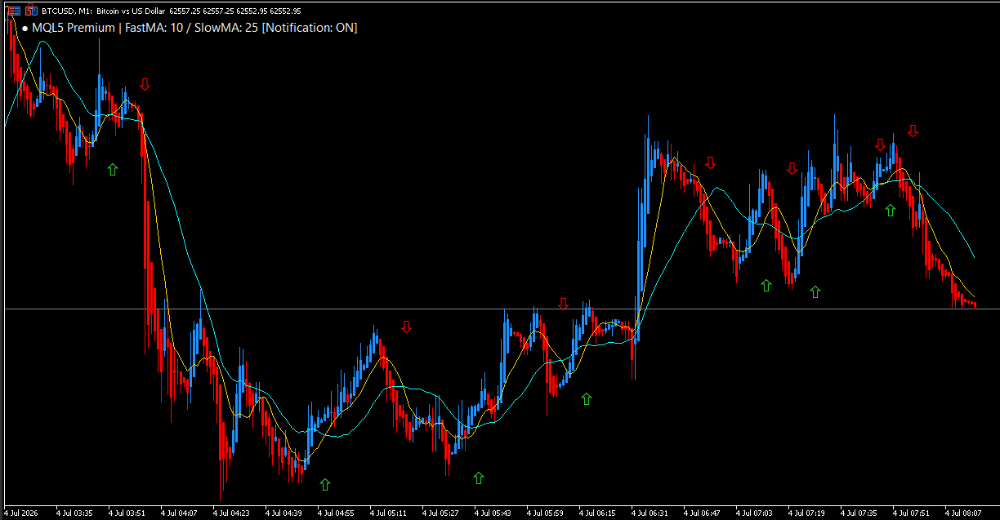

# MQL5 (MT5) 開発ポートフォリオ

MQL5（MetaTrader 5）を用いたカスタムインジケーターおよびEA（自動売買システム）の開発サンプルを公開しています。
確実なロジック実装、オブジェクトを用いた正確なチャート描画、スマホへのリアルタイム通知など、実用性の高い機能を網羅しています。

---

## 🚀 公開中のプロダクト

### 1. MA-Cross Notifier (移動平均線クロス & スマホ通知インジケーター)
短期・長期の移動平均線（MA）のゴールデンクロス・デッドクロスを検知し、チャート上へのサイン描画とスマホへのプッシュ通知を同時に行う実用的なテンプレートです。

#### 🔹 実装機能・特徴
- **高精度なサイン描画**: 数理ロジックにより、矢印サインの重なりやズレを防止（ATR等のボラティリティ追従型の位置微調整機能を搭載）。
- **リアルタイムプッシュ通知**: `SendNotification()` ライブチャート（暗号資産等の24時間動く相場）での確実なスマホ通知着信を検証済み。
- **軽量設計**: チャート表示の負荷を最低限に抑えるため、不要なオブジェクトの自動削除（メモリ解放）ロジックを実装。

#### 📸 動作確認・エビデンス
- **検証環境**: MT5 Build環境にて動作確認済み
- **検証通貨ペア**: BTCUSD (1分足・リアルタイム相場にて検証)

**▼ チャート上へのサイン描画（直近高安値への追従）**

**▼ スマホへのリアルタイムプッシュ通知**
<table border="0" cellpadding="0" cellspacing="10" align="center" style="margin-top: 10px; margin-bottom: 10px;">
  <tr>
    <td valign="top" style="text-align: center;">
      
    </td>
    <td valign="top" style="text-align: center;">
      
    </td>
  </tr>
</table>

---

## 🛠️ 開発における強み（C#等のバックグラウンド）
普段は C# やオブジェクト指向言語を用いたシステム開発を行っているため、MQL5特有の「グローバル変数の乱用によるバグ」や「ポインタの解放漏れによるメモリリーク」を徹底的に排除した、**堅牢で可読性の高いソースコード**を記述します。

- 納品後の仕様変更やロジック追加にも柔軟に対応できる設計
- 厳密なエラーハンドリング（注文エラー、同期エラーの徹底回避）

---

## 💼 お仕事のご依頼について
メールやクラウドワークス等のメッセージ、または「見積もり・カスタマイズの相談」よりお気軽にお問い合わせください。
ロジックの言語化が難しい場合でも、インジケーターの挙動や条件（「〇〇が〇〇を上抜けたら通知」など）をヒアリングしながら仕様書に落とし込みます。

※本リポジトリでは成果物（.ex5）のみを公開しております。ソースコード（.mq5）の提供を含めた開発をご希望の場合は、別途ご相談ください。
